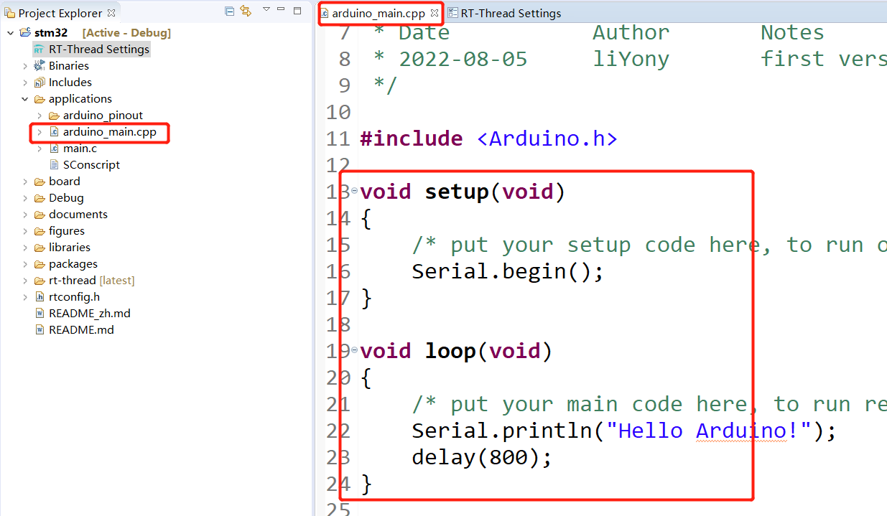
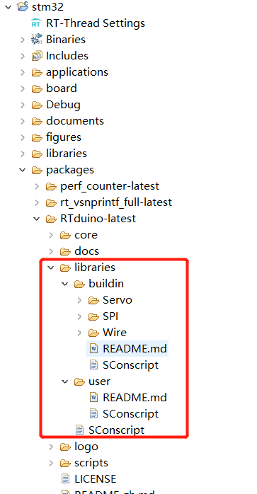
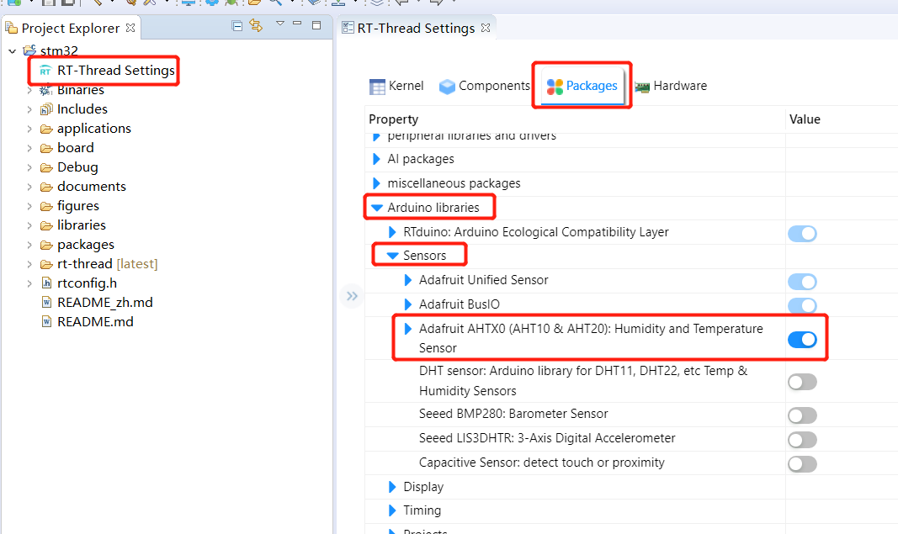
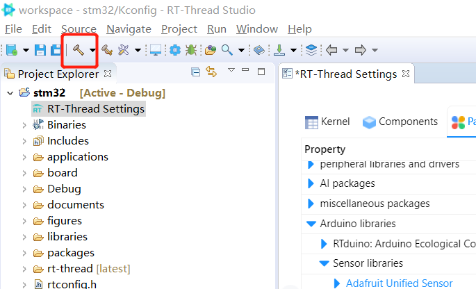
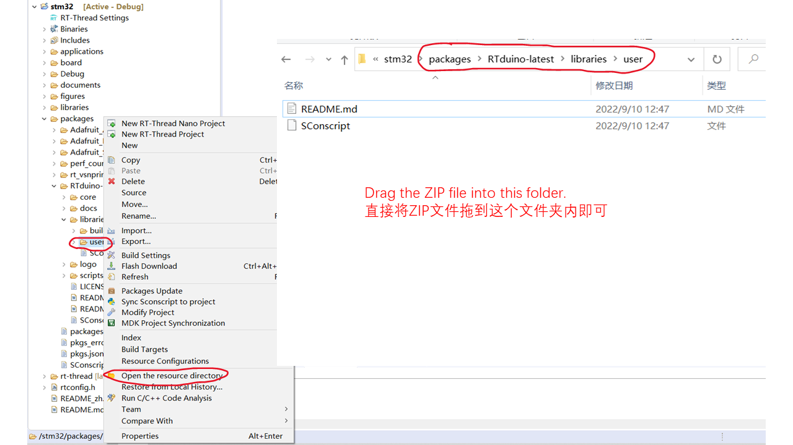
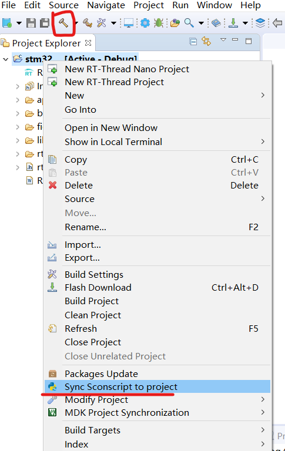

# RT-Thread的Arduino生态兼容层

### 如果喜欢请Star，这是对本开源项目最大的鼓励，谢谢；如果想要贡献PR，请fork

[English](README.md) | **中文**

--------


## 1 简介

RTduino是[RT-Thread实时操作系统](https://www.rt-thread.org)的Arduino生态兼容层，为[RT-Thread社区](https://github.com/RT-Thread/rt-thread)的子社区、Arduino开源项目的下游项目，旨在兼容Arduino社区生态来丰富RT-Thread社区软件包生态（如上千种分门别类的Arduino库，以及Arduino社区优秀的开源项目），并降低RT-Thread操作系统以及与RT-Thread适配的芯片的学习门槛。通过RTduino，可以让用户使用Arduino的函数、编程方法，轻松地将RT-Thread和BSP使用起来。用户也可以直接使用[Arduino第三方库](https://www.arduino.cc/reference/en/libraries/)（例如传感器驱动库、算法库等）直接用在RT-Thread工程中，极大地补充了RT-Thread社区生态。

本软件包可以在[RT-Thread Studio IDE](https://www.rt-thread.org/page/studio.html)和Keil-MDK编译环境下运行，但是，因为Arduino的库都是基于GCC环境开发的，因此**强烈推荐**使用[RT-Thread Studio IDE](https://www.rt-thread.org/page/studio.html)运行。

### 1.1 已经支持Arduino生态兼容层的RT-Thread BSP

| BSP名称                                                                                                                              |
| ---------------------------------------------------------------------------------------------------------------------------------- |
| [ES32F3696](https://github.com/RT-Thread/rt-thread/tree/master/bsp/essemi/es32f369x/applications/arduino_pinout)                   |
| [STM32F103 BluePill](https://github.com/RT-Thread/rt-thread/tree/master/bsp/stm32/stm32f103-blue-pill/applications/arduino_pinout) |
| [STM32F072 Nucleo](https://github.com/RT-Thread/rt-thread/tree/master/bsp/stm32/stm32f072-st-nucleo/applications/arduino_pinout)   |
| [STM32F401 Nucleo](https://github.com/RT-Thread/rt-thread/tree/master/bsp/stm32/stm32f401-st-nucleo/applications/arduino_pinout)   |
| [STM32F411 Nucleo](https://github.com/RT-Thread/rt-thread/tree/master/bsp/stm32/stm32f411-st-nucleo/applications/arduino_pinout)   |
| [STM32F412 Nucleo](https://github.com/RT-Thread/rt-thread/tree/master/bsp/stm32/stm32f412-st-nucleo/applications/arduino_pinout)   |
| [STM32F469 Discovery](https://github.com/RT-Thread/rt-thread/tree/master/bsp/stm32/stm32f469-st-disco/applications/arduino_pinout) |
| [STM32L475潘多拉](https://github.com/RT-Thread/rt-thread/tree/master/bsp/stm32/stm32l475-atk-pandora/applications/arduino_pinout)     |

> 注：RTduino也可以无需适配特定BSP，直接运行在任意RT-Thread BSP上，请参考第5章-RTduino精简模式。

### 1.2 术语说明

[软件包](https://packages.rt-thread.org)：英文为 software package，是指RT-Thread社区所属维护的第三方扩展，是RT-Thread原生生态一部分。

[库](https://www.arduino.cc/reference/en/libraries)：英文为library，是指Arduino社区所属维护的第三方扩展，是Arduino原生生态一部分。

>  库和软件包其实是一个意思，只不过两个社区叫法不一样。

## 2 如何使用RTduino

本节以[STM32L475潘多拉](https://github.com/RT-Thread/rt-thread/tree/master/bsp/stm32/stm32l475-atk-pandora)开发板和[RT-Studio开发环境](https://www.rt-thread.org/page/studio.html)为例，来讲解如何使用本兼容层。

> RTduino 要求 RT-Thread 版本至少为4.1.1

### 2.1 参考资料

- [2022年RT-Thread全球开发者大会报告视频](https://www.bilibili.com/video/BV1Wa411L7B4)

### 2.2 工程的创建和导入

- 请到[RT-Thread Github官方仓库](https://github.com/RT-Thread/rt-thread)，下载最新的源码。对于部分用户下载Github源码慢的问题，可以百度或者到B站搜索“Github加速”等关键字来解决，此处不再赘述。


- 下载好之后请解压，打开RT-Studio IDE，选择文件(File) -> 导入(Import)，并选择RT-Thread BSP Project into Workspace，也就是将BSP工程导入到Studio的选项。


- 路径选择，你刚刚下载解压好的RT-Thread源码，以STM32L475潘多拉板为例：`rt-thread\bsp\stm32\stm32l475-atk-pandora`。工程名字随便起一个就好，比如`STM32`：


- 点击完成(Finish)，稍等片刻即可完成工程导入。

- 导入成功之后，双击RT-Thread Settings，进入到RT-Thread工程配置界面，点击 `<<` 按钮，进入到详细配置页面：


- 点击Hardware，选择 `Compatible with Arduino Ecosystem (RTduino)`，只需要点一下即可，其他依赖项会自动处理。然后点击小锤子按钮进行编译，RT-Thread Studio会自动保存你当前的配置并下载RTduino软件包以及依赖项软件包，并将这些软件包加入到工程中，最后自动编译整个工程。

- 总的来讲，你只需要选择 `Compatible with Arduino Ecosystem (RTduino)`，并点一下小锤子按钮，就坐等编译成功即可。


- 至此，RTduino软件包安装完成，此BSP工程已经具备了兼容Arduino生态的能力。

### 2.3 Arduino经典的setup和loop函数在哪里？

对于Arduino，最经典的莫过于setup和loop函数。这两个函数位于BSP目录下的applications文件夹内arduino_main.cpp文件中。以潘多拉板为例，这两个函数位于：`bsp/stm32/stm32l475-atk-pandora/applications/arduino_main.cpp`文件中，在开启RTduino软件包后，你可以直接在工程的Applications组中找到它。



### 2.4 点一个LED灯吧！

```c
#include <Arduino.h>

void setup(void)
{
    // put your setup code here, to run once:
    pinMode(LED_BUILTIN, OUTPUT);
}

void loop(void)
{
    // put your main code here, to run repeatedly:
    digitalWrite(LED_BUILTIN, !digitalRead(LED_BUILTIN));
    Serial.println("Hello Arduino!");
    delay(100);
}
```

可以看到，板载的LED灯已经开始闪烁，串口开始输出了。

> 注意：
> 
> 由于RT-Thread的main.c文件内，也会默认闪烁一个LED灯，如果板子上只有一个LED灯的话，两个线程会发生干涉。但是你会发现这个LED的闪烁速度明显变快了。因为main.c那边的闪烁周期是1000ms，上面这个例程是200ms。
> 
> 如果你用潘多拉板，main.c闪烁的是红灯，RTduino兼容层的Arduino程序默认闪烁的是绿色的灯，二者不会发生干扰。

### 2.5 RTduino文件夹目录结构

RTduino软件包包含有两个主要的文件夹：core和libraries。



- core文件夹主要是提供Arduino内置的所有的API函数，例如analogWrite、analogRead函数等等，这些函数可以在[Arduino官方](https://www.arduino.cc/reference/en/)找到详细的介绍。

- libraries文件夹是Arduino库所在文件夹。其中：
  
  - buildin文件夹下存放着Arduino内置的一些库，例如Servo舵机驱动库，Wire I2C驱动库等等；
  
  - user文件夹是用户文件夹，这是对用户来说很重要的一个文件夹，里边默认是空的，用户可以把下载好的Arduino库拖入到此文件夹中来，在下个章节会细说这个操作。

### 2.6 具体Arduino引脚分布信息

由于每个BSP的板子设计、以及芯片型号等，引脚分布是有区别的，因此需要到指定BSP的`applications/arduino`文件夹下的README.md文件查看详细信息。例如：

[STM32L475潘多拉板的Arduino引脚布局的详细说明](https://github.com/RT-Thread/rt-thread/tree/master/bsp/stm32/stm32l475-atk-pandora/applications/arduino_pinout) | [STM32F072 Nucleo板的Arduino引脚布局的详细说明](https://github.com/RT-Thread/rt-thread/tree/master/bsp/stm32/stm32f072-st-nucleo/applications/arduino_pinout)

## 3 Arduino库的使用

**注意：任何与Arduino（第三方）库相关的问题，请在本仓库开issue报告**

### 3.1 Arduino内置库

目前RTduino已经支持了大部分的Arduino[原生内建(buildin)的库](https://github.com/arduino/ArduinoCore-avr/tree/master/libraries)，存放于 `libraries/buildin` 文件夹内。具体如下表所示：

| 库名称       | 说明       | 使能宏                     | 备注                                                                                    |
| --------- | -------- | ----------------------- | ------------------------------------------------------------------------------------- |
| Servo     | 舵机库      | RTDUINO_USING_SERVO     | 所有支持PWM功能的BSP均会默认开启该库                                                                 |
| SPI       | SPI库     | RTDUINO_USING_SPI       | 所有支持SPI功能的BSP均会默认开启该库                                                                 |
| Wire      | I2C库     | RTDUINO_USING_WIRE      | 所有支持I2C功能的BSP均会默认开启该库                                                                 |
| USBSerial | USB虚拟串口库 | RTDUINO_USING_USBSERIAL | 按需求手动开启，自动依赖[TinyUSB for RT-Thread](https://github.com/RT-Thread-packages/tinyusb)软件包 |

### 3.2 通过RT-Thread软件包中心加载Arduino第三方库到RT-Thread工程

RT-Thread软件包中心为Arduino第三方库专门创建了一个分类，RTduino社区会将Arduino社区中一些常用的、重要的第三方库注册（如驱动库等）到RT-Thread软件包中心中，用户可以通过RT-Thread Studio或者Env工具一键化下载使用。下面以潘多拉板载的AHT10温湿度传感器为例，讲解如何快速使用Arduino的AHT10温湿度传感器驱动：

- 在导入潘多拉BSP后，打开RT-Thread Settings，选择 `Compatible with Arduino Ecosystem (RTduino)`。此时，工程已经具备支持Arduino生态的能力。

- 点击Package栏，选择Arduino软件包分类，找到Sensor分类（Arduino传感器库分类），找到并选择Adafruit AHTx0驱动。此时，RT-Thread Studio会自动选择该库依赖的其他Arduino库，例如Adafruit Unified Sensor库以及Adafruit BusIO库等。



- 然后点击小锤子编译，RT-Thread Studio会自动下载这些软件包并将工程整体编译一遍。



- 工程编译通过之后，你可以将Adafruit AHTx0库的例程（位于该库文件夹下的examples文件夹）直接复制到arduino_main.cpp文件下运行，你可以看到，串口会输出当前的温湿度，Arduino的例程是直接可以在RT-Thread上运行起来的。

### 3.3 手动导入一个Arduino库到RT-Thread工程

上文提到的通过将Arduino第三方库注册到RT-Thread软件包中心，可以解决Arduino库之间的依赖问题以及中国大陆镜像加速的问题。但是，将Arduino第三方库注册到RT-Thread软件包中心是由RTduino社区维护者手动加载完成的，Arduino第三方库有将近5000个，无法都及时筛选并注册到RT-Thread软件包中心。那么，如果用户想要使用一个没有被注册到软件包中心的Arduino库该怎么办呢？RTduino也提供了可以让用户将其他Arduino库手动导入到RT-Thread工程中的方法，同样也非常方便快捷：

- 首先，你需要到Arduino官方的软件包分类中心去查找你想要的库，或者直接在Github上搜索你想要的库，一般都是C++类型的。

- 下载好之后，直接将zip压缩包（无需解压）拖进RTduino文件夹下的`libraries\user`这个目录下即可。



- 选择当前工程右键选择Sync Sconscript to project也就是让RT-Studio重新扫描并组织一遍工程目录，在扫描的过程中，RT-Studio会自动将zip压缩包解压，并按照Arduino IDE的文件添加逻辑（也就是忽略examples文件夹，并将其他文件夹的.c文件和.h路径添加到工程），将Arduino库添加到RT-Thread工程中来。然后再点一下小锤子按钮来重新编译一下工程。



- 编译完成之后，你就会发现在RTduino的`libraries/user`文件夹下，就会出现你刚刚增加的Arduino库。

## 4 如何给某个BSP适配RTduino

### 4.1 参考资料

- [RTduino BSP对接教程](/docs/zh/RTduino%20BSP%E5%AF%B9%E6%8E%A5%E6%95%99%E7%A8%8B.md)
- [RTduino pinout-generator辅助工具](https://github.com/RTduino/pinout-generator)

### 4.2 创建文件夹和文件

需要在某个BSP的applications文件夹下创建如下文件、文件夹：

参考示例BSP：[STM32F072 Nucleo板applications文件夹](https://github.com/RT-Thread/rt-thread/tree/master/bsp/stm32/stm32f072-st-nucleo/applications/arduino_pinout) | [STM32L475 潘多拉板applications文件夹](https://github.com/RT-Thread/rt-thread/tree/master/bsp/stm32/stm32l475-atk-pandora/applications)

#### 4.2.1 arduino_main.cpp文件

该文件是Arduino的编程入口，提供setup和loop函数。在loop函数默认以200ms为周期，闪烁Arduino内建LED灯（LED_BUILTIN）。如果该BSP默认支持SPI功能且为UNO引脚布局，由于SPI和LED_BUILTIN可能存在冲突(D13)，可以在loop函数内以 `Serial.println("Hello Arduino\n");` 代替频闪LED（例如[STM32F401 Nucleo板](https://github.com/RT-Thread/rt-thread/blob/master/bsp/stm32/stm32f401-st-nucleo/applications/main.c)）。

#### 4.2.2 arduino_pinout文件夹

需要在applications文件夹下创建arduino_pinout文件夹，这个文件夹主要包含 `arduino_pinout.c` 和 `arduino_pinout.h` 两个关键的文件，这两个文件是对接的关键。用户只需要做好这两个文件，即可完成与RTduino的对接。

同时，这个文件夹内也需要SConscript脚本文件，以及提供Arduino引脚布局的README说明文档。请参照上面的示例BSP来完成对这两个文件的编写。

#### 4.2.3 arduino_pinout.c 文件的编写

`arduino_pinout.c` 内需要完成一个IO编号和功能的映射表。由于Arduino的习惯是采用1-13 (D0-D13) 以及 A0-A5的引脚编号，而正规的MCU的引脚编号一般都是PA1之类，因此需要将MCU真正的引脚编号与Arduino引脚编号映射起来。

以下段代码来举例讲解：

```c
/* 按照先数字引脚后模拟引脚的顺序从0开始，一定要按序排列 */
/* 可以按照板卡实际IO情况，灵活调整功能，不一定非得按照Arduino UNO的引脚功能布局，但是建议按此布局设计 */
/*
 * {Arduino Pin, RT-Thread Pin [, Device Name, Channel]}
 * [] means optional
 * Digital pins must NOT give the device name and channel.
 * Analog pins MUST give the device name and channel(ADC, PWM or DAC).
 * Arduino Pin must keep in sequence.
 */
const pin_map_t pin_map_table[]=
{
    {D0, GET_PIN(A,3), "uart2"},        /* Serial-Rx */
    {D1, GET_PIN(A,2), "uart2"},        /* Serial-Tx */
    {D2, GET_PIN(A,10)},
    {D3, GET_PIN(B,3), "pwm2", 2},      /* PWM */
    {D4, GET_PIN(B,5)},
    {D5, GET_PIN(B,4), "pwm3", 1},      /* PWM */
    {D6, GET_PIN(B,10), "pwm2", 3},     /* PWM */
    {D7, GET_PIN(A,8)},
    {D8, GET_PIN(A,9)},
    {D9, GET_PIN(C,7), "pwm3", 2},      /* PWM */
    {D10, GET_PIN(B,6), "pwm16", -1},   /* PWM */
    {D11, GET_PIN(A,7), "pwm17", 1},    /* PWM */
    {D12, GET_PIN(A,6)},
    {D13, GET_PIN(A,5)},                /* LED_BUILTIN */
    {D14, GET_PIN(B,9), "i2c1"},        /* I2C-SDA (Wire) */
    {D15, GET_PIN(B,8), "i2c1"},        /* I2C-SCL (Wire) */
    {D16, GET_PIN(C,13)},               /* USER KEY */
    {A0, GET_PIN(A,0), "adc1", 0},      /* ADC */
    {A1, GET_PIN(A,1), "adc1", 1},      /* ADC */
    {A2, GET_PIN(A,4), "adc1", 4},      /* ADC */
    {A3, GET_PIN(B,0), "adc1", 8},      /* ADC */
    {A4, GET_PIN(C,1), "adc1", 11},     /* ADC */
    {A5, GET_PIN(C,0), "adc1", 10},     /* ADC */
    {A6, RT_NULL, "adc1", 17},          /* ADC, On-Chip: internal reference voltage, ADC_CHANNEL_VREFINT */
    {A7, RT_NULL, "adc1", 16},          /* ADC, On-Chip: internal temperature sensor, ADC_CHANNEL_TEMPSENSOR */
};
```

如上截取展示了IO编号和功能映射表，每一行用花括号包裹（实际是一个结构体）来建议一个IO的映射关系：

```
{Arduino引脚编号, RT-Thread引脚编号(通过GET_PIN宏获取), 复用功能的设备名(PWM、ADC或DAC), 该复用功能设备的通道号}
```

其中，Arduino引脚编号，即是第一个参数，是必填的，D0 - Dx 或者是 A0 - Ax。注意一定要按先数字引脚后模拟引脚照顺序来填写。

RT-Thread引脚编号，即第二个参数，rt_pin_write中引脚编号填什么，这里就填什么，一般使用 `GET_PIN` 宏来获取。注意：D0、D1以及I2C、SPI IO需要将此参数略过。

后两个参数是复用功能IO才需要填写的，普通引脚只需要略过即可。

#### 4.2.4 arduino_pinout.h 文件的编写

参考示例BSP：[STM32L475 潘多拉板applications文件夹](https://github.com/RT-Thread/rt-thread/tree/master/bsp/stm32/stm32l475-atk-pandora/applications/arduino_pinout/pins_arduino.h)

该文件主要负责定义各种宏，包括：

D0、A0等引脚的数字宏，该宏一定要按照先数字引脚后模拟引脚的顺序进行排号。

定义默认开启的一些硬件功能，如下表所示：

```c
/* pins alias. Must keep in sequence */
/* 按照先数字引脚后模拟引脚的顺序从0开始，一定要按序排列 */
/* 可以按照板卡实际IO情况，灵活调整功能，不一定非得按照Arduino UNO的引脚功能布局，但是建议按此布局设计 */
#define D0   (0)
#define D1   (1)
#define D2   (2)
#define D3   (3)
#define D4   (4)
#define D5   (5)
#define D6   (6)
#define D7   (7)
#define D8   (8)
#define D9   (9)
#define D10  (10)
#define D11  (11)
#define D12  (12)
#define D13  (13)
#define D14  (14)
#define D15  (15)
#define D16  (16)
#define D17  (17)
#define D18  (18)
#define D19  (19)
#define D20  (20)
#define D21  (21)
#define D22  (22)
#define D23  (23)
#define D24  (24)
#define D25  (25)
#define D26  (26)
#define D27  (27)
#define D28  (28)
#define D29  (29)
#define D30  (30)
#define D31  (31)
#define D32  (32)
#define A0   (33)
#define A1   (34)
#define A2   (35)
#define A3   (36)
#define DAC0 (37)

#define F_CPU  80000000L /* CPU: 80MHz，定义CPU的主频 */
#define LED_BUILTIN  D22 /* Default Built-in LED，定义Arduino内置LED的引脚编号 */

/* 定义I2C设备名称，在使用Wire库时会直接调用。可选，如果没有I2C功能，不需要定义该宏 */
#define RTDUINO_DEFAULT_IIC_BUS_NAME            "i2c4"

/* 定义SPI设备名称，在使用SPI库时会直接调用。可选，如果没有SPI功能，不需要定义该宏 */
#define RTDUINO_DEFAULT_SPI_BUS_NAME            "spi2"

#define SS  D26 /* 定义SPI片选引脚 */

/* 
   定义高精度定时器设备名称，该宏主要是提供us时基信号使用。
   所有Cortex-M核MCU均不需要定义此宏，RTduino会自动调用systick来计算us级时间戳。
   非Cortex-M核的MCU需要提供一个硬件定时器来提供us级时间戳。
 */
#define RTDUINO_DEFAULT_HWTIMER_DEVICE_NAME     "timer7"

/* 如果有串口2、串口3可以定义串口2、3的设备名称，若没有可直接不定义此宏 */
#define RTDUINO_SERIAL2_DEVICE_NAME             "uart2"
```

### 4.3 修改Kconfig文件

Kconfig文件位于BSP的board文件夹下：

参考示例BSP：[STM32F072 Nucleo板Kconfig](https://github.com/RT-Thread/rt-thread/blob/master/bsp/stm32/stm32f072-st-nucleo/board/Kconfig) | [STM32L475 潘多拉板Kconfig](https://github.com/RT-Thread/rt-thread/blob/master/bsp/stm32/stm32l475-atk-pandora/board/Kconfig)

```Kconfig
menu "Onboard Peripheral Drivers"
    config BSP_USING_STLINK_TO_USART
        bool "Enable STLINK TO USART (uart2)"
        select BSP_USING_UART
        select BSP_USING_UART2
        default y

    #增加 BSP_USING_ARDUINO 配置选项
    config BSP_USING_ARDUINO
        bool "Compatible with Arduino Ecosystem (RTduino)"
        select PKG_USING_RTDUINO
        select BSP_USING_STLINK_TO_USART
        select BSP_USING_GPIO
        select BSP_USING_ADC
        select BSP_USING_ADC1
        select BSP_USING_PWM
        select BSP_USING_PWM2
        select BSP_USING_PWM2_CH2
        select BSP_USING_PWM2_CH3
        select BSP_USING_PWM3
        select BSP_USING_PWM3_CH1
        select BSP_USING_PWM3_CH2
        select BSP_USING_PWM16
        select BSP_USING_PWM16_CH1
        select BSP_USING_PWM17
        select BSP_USING_PWM17_CH1
        select BSP_USING_I2C
        select BSP_USING_I2C1
        imply RTDUINO_USING_SERVO
        imply RTDUINO_USING_WIRE
        imply RTDUINO_USING_ADAFRUIT
        default n

endmenu
```

需要在`Onboard Peripheral Drivers`栏下增加 `BSP_USING_ARDUINO` 配置选项，并依赖相应的PWM、ADC、UART、I2C以及SPI等设备框架，满足一键化开启RTduino的能力。

### 4.4 编写Arduino引脚布局(pinout)的README说明文档

示例： [STM32F072 Nucleo的Arduino引脚布局说明文档](https://github.com/RT-Thread/rt-thread/blob/master/bsp/stm32/stm32f072-st-nucleo/applications/arduino_pinout/README.md) | [STM32L475潘多拉的Arduino引脚布局说明文档](https://github.com/RT-Thread/rt-thread/blob/master/bsp/stm32/stm32l475-atk-pandora/applications/arduino_pinout/README.md)

该文档需位于`applications/arduino_pinout/README.md`，主要介绍该BSP下的Arduino引脚编号和引脚功能，以及注意事项等。

## 5 RTduino精简模式（快速使用，无需适配特定BSP）

### 5.1 不使用setup-loop编程模型

`setup()` 和 `loop()` 函数是Arduino编程中非常经典的函数，当你在Arduino IDE中新建一个文件时，默认就提供了这两个函数。这两个函数RTduino是完全支持的（参见第4章），但是一些较为复杂或庞大的业务逻辑如果放在setup-loop函数中就会受到一些束缚。因此，可以在Env或者RT-Thread Studio的RT-Thread Settings中取消setup-loop编程模型：

```Kconfig
RT-Thread online packages  --->
    system packages  --->
         [*] RTduino: Arduino Ecological Compatibility Layer  --->
              [*]   Don't use setup-loop structure  --->
```

选择此选项后，用户可以直接在 `core/arduino_thread.c` 中的 `arduino_entry` 线程函数中直接编程，或者在任意.cpp文件中调用Arduino API（不局限于Arduino线程，只要是.cpp文件下调用即可）。

### 5.2 如何不用定义引脚映射表，更方便的使用RTduino？

通过上文，我们可以看到，RTduino软件包并不是直接可以用的，需要RT-Thread BSP方面提供一些配套的支持，如引脚映射表（arduino_pinout）等。但是，如果用户不想使用Arduino引脚（IO）相关的API（如analogRead等），只想借助RTduino软件包，来直接兼容运行I2C芯片驱动库、纯软件算法库等和IO无关的函数和库，如何快速的使用起来呢？

用户可以直接在Env或者RT-Thread Studio的RT-Thread Settings中选择精简模式 (Enable tiny mode)。在选择精简模式后，用户就无需定义引脚映射表，直接就可以使用Arduino库中的非IO相关的函数和库了。开启精简模式后，会自动开启 5.1 章节所介绍的不使用setup-loop编程模型选项，用户可以在任意.cpp文件下使用Arduino API。

```Kconfig
RT-Thread online packages  --->
    system packages  --->
         [*] RTduino: Arduino Ecological Compatibility Layer  --->
              -*-   Don't use setup-loop structure
              [*]   Enable tiny mode  --->
```

### 5.3 常规模式（参见第4章）vs 精简模式（参见第5章）

在[Arduino API可兼容性一览表](docs/zh/Arduino%20API%E5%8F%AF%E5%85%BC%E5%AE%B9%E6%80%A7%E4%B8%80%E8%A7%88%E8%A1%A8.md)文档中，列举了在两种不同模式下，RTduino对Arduino API的兼容情况。

## 6 需要注意的事项

### 6.1 包含Arduino.h头文件

调用到Arduino相关函数和宏的源文件，请包含Arduino.h头文件，否则可能会报错：


### 6.2 Keil-MDK

如果使用Keil AC5环境，需要勾选GNU extension。AC6不需要。RTduino本身可以在Keil-MDK AC5环境下编译通过，但是不保证所有第三方Arduino库均可顺利编译通过，因为Arduino库是在GNU-C下编写的，AC5不支持GNU-C扩展语法。如果非要使用Keil，建议使用AC6。

### 6.3 启用PWM不能调用pinMode函数，否则PWM会失效，ADC、DAC同理

```c
void setup() {
  //Declaring LED pin as output
  //pinMode(led_pin, OUTPUT); //不能设置为OUTPUT，否则PWM会失效
}
void loop() {
  //Fading the LED
  for(int i=0; i<255; i++){
    analogWrite(led_pin, i);
    delay(5);
  }
  for(int i=255; i>0; i--){
    analogWrite(led_pin, i);
    delay(5);
  }
}
```

因为底层已经将对应的PWM、ADC或DAC的IO设置为模拟输入或者复用推挽，调用pinMode之后把IO模式改成了纯输入输出，原有的PWM、ADC或DAC功能将无法使用。该问题无要修正，只需要知道调用analogRead和analogWrite的时候不需要设置pinMode即可。一旦调用pinMode，该引脚将丧失analogWrite或者analogRead功能，后续只能当做普通IO使用。
Arduino [官方文档](https://www.arduino.cc/reference/en/language/functions/analog-io/analogwrite/)也是这么建议的：

```markdown
You do not need to call pinMode() to set the pin as an output before calling analogWrite().
The analogWrite function has nothing to do with the analog pins or the analogRead function.
```

用户如果对PWM、ADC或DAC引脚使用pinMode函数，在终端也会给出警告：


当然，如果用户已经知道这样做的后果，但是故意需要将PWM、ADC或DAC引脚通过pinMode函数转为普通IO也是完全可以的。

### 6.4 Serial.begin

在很多Arduino例程中，都喜欢使用如下语句来初始化串口：

```c
  Serial.begin(9600);
```

这句话将串口默认初始化成波特率为9600. 但是在RT-Thread中，串口的初始化实际是有RT-Thread驱动框架负责的，并且默认波特率为115200. 因此如果调用`Serial.begin(9600)` 函数后，串口的波特率将会从默认的115200调整为9600。如果你的终端或者串口助手还保持在115200的波特率，那么接收数据将出现乱码。

**因此建议：** 使用`Serial.begin()`代替`Serial.begin(9600)`。`Serial.begin()`无参数方法是RTduino的扩充方法，其表示跟随使用RT-Thread串口配置，不重新配置串口。

### 6.5 SPI.begin() / Wire.begin()

使用非默认的SPI/I2C时，只需要在初始化函数中传入对应的rt-thread设备名，如`SPI.begin("spi1")` 或 `Wire.begin("i2c1")`

## 7 贡献与维护

该项目于2021年12月立项，由RT-Thread社区核心开发和维护者[满鉴霆](https://github.com/mysterywolf)发起。

### 7.1 项目仓库地址

https://github.com/RTduino/RTduino

https://gitee.com/rtduino/RTduino

### 7.2 感谢以下小伙伴对本仓库的贡献

<a href="https://github.com/RTduino/rtduino/graphs/contributors">
  
</a>
