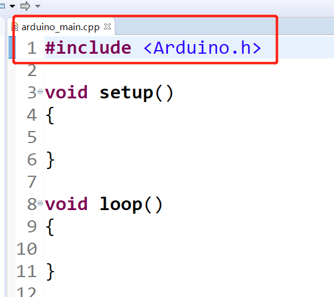

## 1 扩展API

### 1.1 Arduino其他生态中扩展的API（如STM32、ESP32）
以下三个函数为非Arduino-AVR中存在，但是在Arduino-STM32中扩展：

- analogReadResolution()
- analogWriteResolution()
- analogWriteFrequency()

### 1.2 RTduino扩展API

- mapFloat() 双精度浮点映射

## 2 包含Arduino.h头文件
调用到Arduino相关函数和宏的源文件，请包含Arduino.h头文件




## 3 Keil AC5
如果使用Keil AC5环境，需要勾选GNU extension。AC6不需要。

## 4 启用PWM不能调用pinMode函数，否则PWM会失效，ADC、DAC同理
```c
void setup() {
  //Declaring LED pin as output
  //pinMode(led_pin, OUTPUT); //不能设置为OUTPUT，否则PWM会失效
}
void loop() {
  //Fading the LED
  for(int i=0; i<255; i++){
    analogWrite(led_pin, i);
    delay(5);
  }
  for(int i=255; i>0; i--){
    analogWrite(led_pin, i);
    delay(5);
  }
}
```

因为底层已经将对应的PWM、ADC或DAC的IO设置为模拟输入或者复用推挽，调用pinMode之后把IO模式改成了纯输入输出，原有的PWM、ADC或DAC功能将无法使用。该问题无要修正，只需要知道调用analogRead和analogWrite的时候不需要设置pinMode即可。一旦调用pinMode，该引脚将丧失analogWrite或者analogRead功能，后续只能当做普通IO使用。
Arduino [官方文档](https://www.arduino.cc/reference/en/language/functions/analog-io/analogwrite/)也是这么建议的：
``` markdown
You do not need to call pinMode() to set the pin as an output before calling analogWrite().
The analogWrite function has nothing to do with the analog pins or the analogRead function.
```

用户如果对PWM、ADC或DAC引脚使用pinMode函数，在终端也会给出警告：


当然，如果用户已经知道这样做的后果，但是故意需要将PWM、ADC或DAC引脚通过pinMode函数转为普通IO也是完全可以的。

## 5 Serial.begin

在很多Arduino例程中，都喜欢使用如下语句来初始化串口：
```c
  Serial.begin(9600);
```
这句话将串口默认初始化成波特率为9600. 但是在RT-Thread中，串口的初始化实际是有RT-Thread驱动框架负责的，并且默认波特率为115200. 因此如果调用`Serial.begin(9600)` 函数后，串口的波特率将会从默认的115200调整为9600。如果你的终端或者串口助手还保持在115200的波特率，那么接收数据将出现乱码。

**因此建议：** 使用`Serial.begin()`代替`Serial.begin(9600)`。`Serial.begin()`无参数方法是RTduino的扩充方法，其表示跟随使用RT-Thread串口配置，不重新配置串口。
